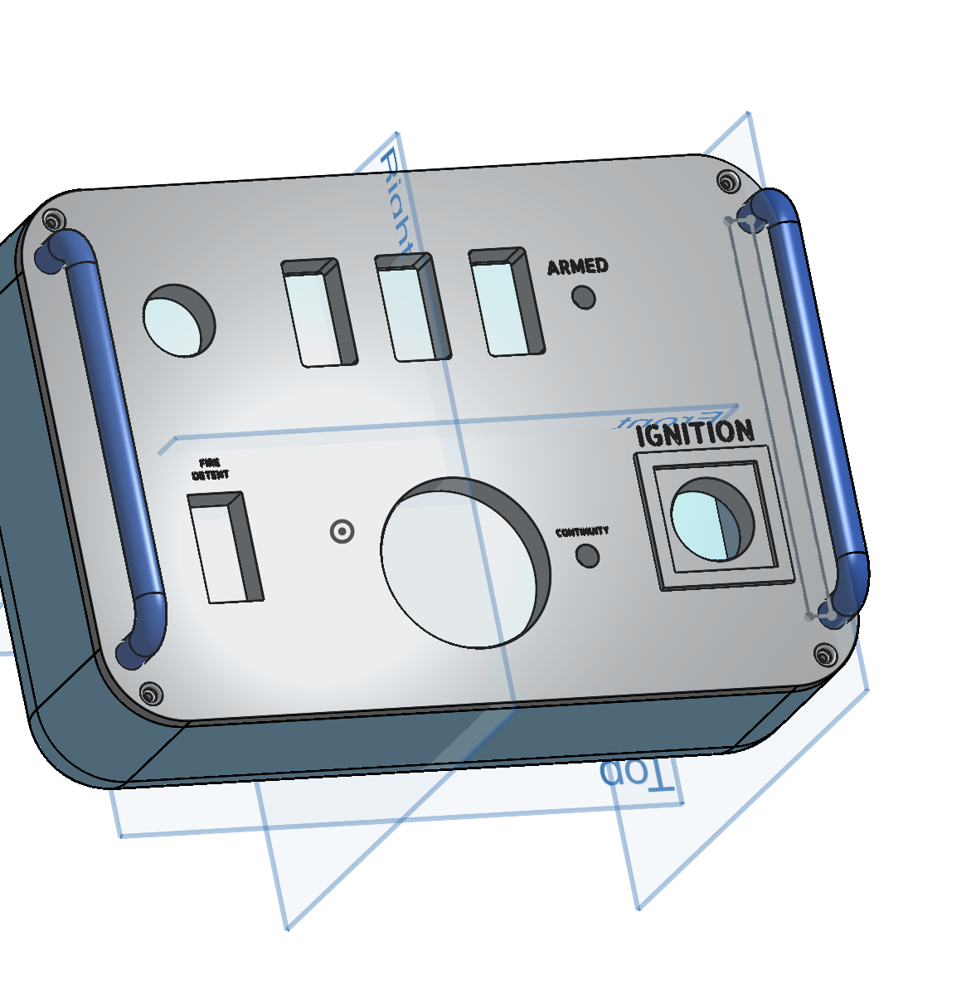
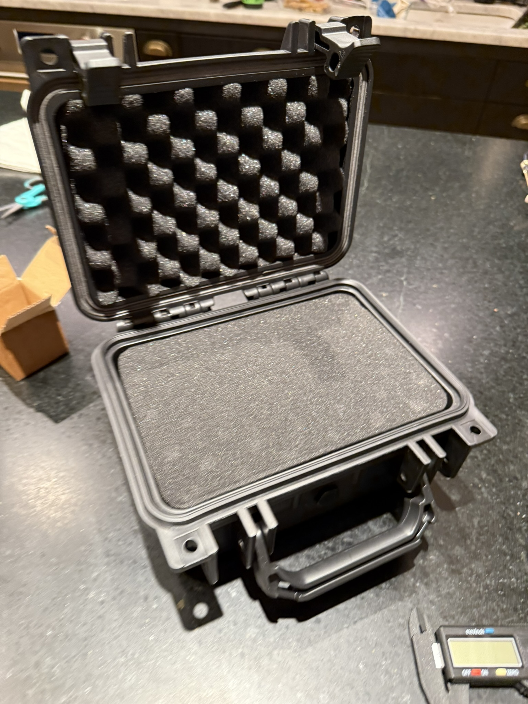

# Launch Control System
**In Short:** 	Created a chemical rocket motor launch control box with a voltage and continuity check, as well as a complete key locked arming and safety system.

## The Process:
### Research:
I started the project by researching how these controllers work.
For a model rocket to launch the igniter must burn inside to start the reaction. This igniter works by receiving a high voltage which overheats it and causes it to burn. If the voltage is too low, the electricity just passes through and it can work in a circuit. This is helpful for ensuring that there is "continuity" in the circuit. To take advantage of this, you need a resistor before the igniter so that it does not get the full voltage from the batteries. Since LEDs naturally have resistance, it is helpful to use them as they display light if circuit continuity exists. Electricity uses the path of least resistance and so you can have an alternative connection which bypasses the light that is button activated, when that happens, nothing resists the voltage of the battery and the Igniter receives the voltage needed to melt.

### Design:
For my design I wanted to have a system with a keyslot so that any accidental launch by somebody without the key is impossible. In addition,  I wanted to have 3 arming switches and then finally a safety which must be held down to press the "big red button" to launch. Finally, to ensure that the proper voltage is being used, I wanted to have an analog voltmeter to be observable during launch.

To create all of this,  I started by making a 3D printable panel in the CAD software: Onshape. Before I could even do that however, I had to pick which buttons and switches I would use for the box. After many hours of research on Amazon I found ones that were suitable for this project and took their measurements. With that, I could actually start prototyping the panel.

Of course the panel would not be complete, (nor look very good), without an external case to contain it, for that, I picked out a suitable hardshell pelican style case which I ordered online.

After a few 3D printing tests to get the tolerances right, the panel and holding plastic container both fit together, fit with the switches, and fit in the pelican case. I made sure to test fit all the parts, and once that was complete all that needed to be done was the soldering.
#### PHOTO OF CASE WITH STUFF IN IT IMG_7407.JPEG
Without much soldering experience, this quickly became the most difficult part of the project. With a lot of places an error could pop up, I made sure to individually test the continuity of every electronic component before soldering. Even once connected to the larger system, I continued to test the power levels with an LED designed to handle larger voltages, using the brightness as an indicator.
#### PHOTO OF WIRES IMG_7423.JPEG
After many late nights and hours of assembly, I finished the launch controller.
Amazingly, it worked on the first test without further modifications.
#### PHOTO OF FINISHED GOX IMG_7431.JPEG
Here is a photo of it being used on its first launch:
#### IMG_7645.JPEG

### Image Gallery:
IMG_7389.JPEG
IMG_7398.JPEG
IMG_7420.JPEG
IMG_7424.JPEG
IMG_7425.JPEG

